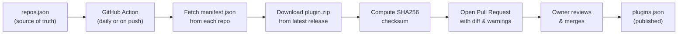
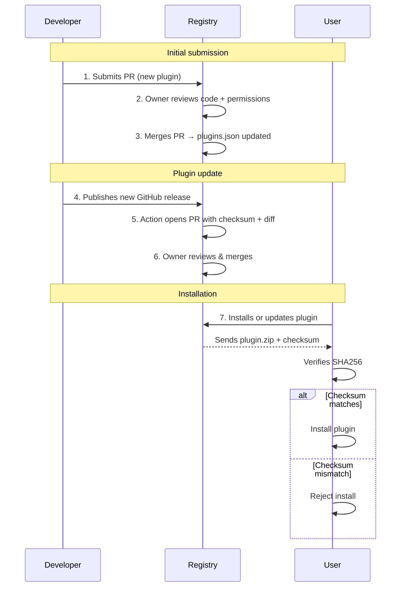
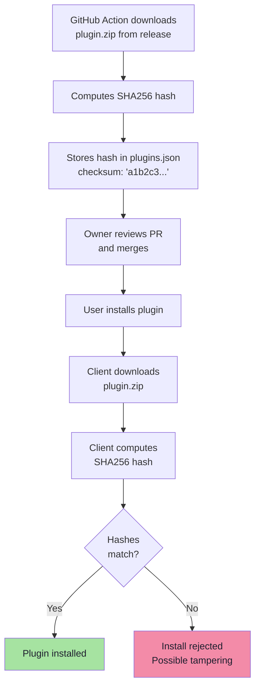

# SimplyTerm Plugin Registry

Official plugin registry for [SimplyTerm](https://github.com/arediss/SimplyTerm). The app fetches `plugins.json` to discover, install, and update plugins from this registry.

---

## Table of contents

- [How it works](#how-it-works)
- [Publishing a plugin](#publishing-a-plugin)
  - [1. Create your plugin repository](#1-create-your-plugin-repository)
  - [2. Create a GitHub Release](#2-create-a-github-release)
  - [3. Submit to the registry](#3-submit-to-the-registry)
- [Updating your plugin](#updating-your-plugin)
- [Security model](#security-model)
  - [How the review process works](#how-the-review-process-works)
  - [Integrity verification (SHA256 checksum)](#integrity-verification-sha256-checksum)
  - [Permission tracking](#permission-tracking)
- [Permissions reference](#permissions-reference)
- [Available categories](#available-categories)
- [Registry URL](#registry-url)

---

## How it works



The registry is built around three files:

| File | Role | Who edits it |
|------|------|-------------|
| `repos.json` | List of approved plugin repositories + their approved permissions | You (via PR) |
| `plugins.json` | Full plugin index with metadata, download URLs, and checksums | GitHub Action (auto-generated) |
| `update-registry.yml` | Workflow that fetches, verifies, and proposes updates | Nobody (runs automatically) |

The key principle: **no plugin code reaches users without a human review.** Every change goes through a Pull Request.

---

## Publishing a plugin

### 1. Create your plugin repository

Your repo must contain a `manifest.json` at the root:

```json
{
  "id": "com.yourname.your-plugin",
  "name": "Your Plugin",
  "version": "1.0.0",
  "api_version": "1.0.0",
  "description": "A short description of what your plugin does",
  "author": "Your Name",
  "license": "MIT",
  "category": "tools",
  "keywords": ["keyword1", "keyword2"],
  "permissions": ["ui_notifications"],
  "main": "index.js"
}
```

**Fields:**

| Field | Required | Description |
|-------|----------|-------------|
| `id` | Yes | Unique identifier in reverse domain notation (`com.yourname.plugin-name`) |
| `name` | Yes | Display name shown in the plugin browser |
| `version` | Yes | Semver version (`major.minor.patch`) |
| `api_version` | Yes | Minimum SimplyTerm API version required (currently `1.0.0`) |
| `description` | Yes | Short description of what the plugin does |
| `author` | Yes | Author name |
| `license` | No | SPDX license identifier (e.g., `MIT`, `GPL-3.0`) |
| `category` | No | One of the [available categories](#available-categories) |
| `keywords` | No | Array of search keywords |
| `permissions` | Yes | Array of [permissions](#permissions-reference) your plugin needs |
| `main` | Yes | Entry point file (usually `index.js`) |

### 2. Create a GitHub Release

Package your plugin files into a zip and attach it to a GitHub Release:

```bash
# Create the zip (include all plugin files)
zip plugin.zip manifest.json index.js

# Create a release using the GitHub CLI
gh release create v1.0.0 plugin.zip --title "v1.0.0" --notes "Initial release"
```

> **Important:** Name the zip asset **`plugin.zip`** so the registry can find it automatically. If the asset has a different name, the registry will look for any `.zip` file as a fallback.

### 3. Submit to the registry

Open a Pull Request on this repository adding your plugin to `repos.json`:

```json
{
  "plugins": [
    {
      "repository": "yourname/your-plugin-repo",
      "approved_permissions": ["ui_notifications"]
    }
  ]
}
```

The `approved_permissions` array must match the `permissions` in your `manifest.json`. The registry owner will:

1. Review your plugin source code
2. Verify the permissions are justified
3. Merge the PR

Once merged, the GitHub Action picks up your plugin and adds it to `plugins.json` on its next run.

---

## Updating your plugin

To publish a new version:

1. Update `version` in your `manifest.json`
2. Create a new `plugin.zip` with the updated files
3. Create a new GitHub Release with the zip attached

```bash
zip plugin.zip manifest.json index.js
gh release create v1.1.0 plugin.zip --title "v1.1.0" --notes "What changed"
```

**That's it.** The registry Action will:

- Detect the new version on its next run (daily at 6:00 UTC, or trigger it manually)
- Download the new `plugin.zip` and compute its SHA256 checksum
- Open a Pull Request with a summary like:

```markdown
## Registry Update
### Changes
- **Your Plugin**: `1.0.0` → `1.1.0` (repo | release)
```

The update will only reach users **after the PR is reviewed and merged**.

> **If you change permissions** (e.g., add `shell_execute`), the PR will include a security warning. You'll need to update `approved_permissions` in `repos.json` as well.

---

## Security model

SimplyTerm takes plugin security seriously. The registry implements multiple layers of protection to ensure that users only install verified, reviewed code.

### How the review process works



No code reaches users without passing through steps 2-3 (initial) or 5-6 (updates).

### Integrity verification (SHA256 checksum)

Every plugin zip has a SHA256 checksum that guarantees the file hasn't been tampered with.

**What is a SHA256 checksum?**

It's a cryptographic fingerprint of a file. Feed any file into the SHA256 algorithm and you get a unique 64-character hex string. Change even a single byte in the file and the hash changes completely.

```
plugin.zip (original)       → sha256 → a1b2c3d4e5f6...
plugin.zip (1 byte changed) → sha256 → 9x8y7z6w5v4u... (completely different)
```

**How SimplyTerm uses it:**



**What this protects against:**

- A compromised CDN serving a modified zip
- A man-in-the-middle attack altering the download
- A developer replacing a release asset after the registry approved it

> **Note:** The SimplyTerm client **requires** a checksum. If `plugins.json` has `"checksum": null`, the install will be rejected.

### Permission tracking

Plugins declare the permissions they need in `manifest.json`. The registry tracks which permissions were approved.

**How it works:**

1. When you submit a plugin, you list its permissions in `repos.json` under `approved_permissions`
2. The GitHub Action compares the manifest's `permissions` with `approved_permissions` on every run
3. If they don't match (e.g., a new version added `vault_read`), the PR includes a warning:

```markdown
### ⚠ Security Warnings
⚠ **Your Plugin** (yourname/your-repo): permissions changed!
  - Approved: `ui_notifications`
  - Current:  `ui_notifications,vault_read`
```

4. The owner must update `approved_permissions` in `repos.json` if the new permissions are justified

**Why this matters:** A plugin that initially only needed `ui_notifications` could silently add `terminal_read` + `network_http` in an update, allowing it to read SSH passwords and send them to a remote server. Permission tracking catches this.

---

## Permissions reference

Plugins must declare every permission they need. Users see these permissions in an approval dialog before enabling the plugin.

### Low risk (read-only, non-sensitive)

| Permission | Description |
|-----------|-------------|
| `sessions_read` | Read saved sessions and their configuration |
| `sessions_metadata_read` | Read plugin-specific session metadata |
| `folders_read` | Read folder organization structure |
| `vault_status` | Check if the secure vault is locked or unlocked |
| `settings_read` | Read application settings and preferences |
| `recent_read` | Read recently used sessions history |
| `events_subscribe` | Listen to application events |
| `fs_read` | Read files from plugin data directory |
| `bastions_read` | Read bastion/jump host profiles |
| `known_hosts_read` | Read SSH known hosts entries |

### Medium risk (write access or network)

| Permission | Description |
|-----------|-------------|
| `sessions_write` | Create, modify, and delete saved sessions |
| `sessions_metadata_write` | Write plugin-specific session metadata |
| `folders_write` | Create, modify, and delete folders |
| `settings_write` | Modify application settings and preferences |
| `recent_write` | Modify recently used sessions history |
| `events_emit` | Send custom events to other plugins |
| `network_http` | Make HTTP/HTTPS requests to remote servers |
| `network_websocket` | Establish WebSocket connections |
| `fs_write` | Write files to plugin data directory |
| `terminal_read` | Read terminal output |
| `clipboard_read` | Read content from system clipboard |
| `clipboard_write` | Write content to system clipboard |
| `bastions_write` | Create, modify, and delete bastion profiles |
| `known_hosts_write` | Manage SSH known hosts entries |
| `vault_export_encrypted` | Export the encrypted vault bundle for sync/backup |
| `vault_import_encrypted` | Import and overwrite the encrypted vault bundle |
| `ui_notifications` | Display system notifications |
| `ui_panels` | Register custom panels in the interface |
| `ui_commands` | Register commands in the command palette |
| `ui_modals` | Display modal dialogs |
| `ui_sidebar` | Register sections in the sidebar |
| `ui_context_menu` | Add items to context menus |
| `ui_menu` | Add items to application menus |
| `ui_settings` | Add a settings panel in preferences |

### High risk (sensitive data or system access)

These permissions trigger a warning in the user's approval dialog.

| Permission | Description |
|-----------|-------------|
| `sessions_connect` | Initiate connections to remote hosts |
| `vault_read` | Read encrypted data from the secure vault |
| `vault_write` | Store encrypted data in the secure vault |
| `shell_execute` | Execute shell commands on the local system |
| `terminal_write` | Write data to terminal sessions |

> **Tip:** Only request the permissions your plugin actually needs. Requesting unnecessary high-risk permissions will make users less likely to install your plugin.

---

## Available categories

| Category | Description |
|----------|-------------|
| `themes` | Visual themes and color schemes |
| `productivity` | Workflow and productivity tools |
| `security` | Security and credential management |
| `devops` | DevOps and infrastructure tools |
| `tools` | General-purpose utilities |

---

## Automatic cleanup

The Action automatically removes plugins from the registry when their repository is:

- **Deleted** (404)
- **Archived**

This keeps the registry clean without manual intervention.

---

## Registry URL

```
https://arediss.github.io/simplyterm-plugin-registry/plugins.json
```
